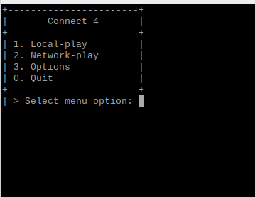

Connect 4
======
[**Connect 4**](https://en.wikipedia.org/wiki/Connect_Four) is a two-player connection board game, in which the players choose a color and then take turns dropping colored discs into a seven-column, six-row vertically suspended grid. The pieces fall straight down, occupying the lowest available space within the column. The objective of the game is to be the first to form a horizontal, vertical, or diagonal line of four of one's own discs.

This project is developed in Python, utilizing PyGame3, specifically for CSE550: Software Engineering.

#### Screenshot


## Features
* None (move features from To-Do to Features tab once implemented) 

## To-Do
* Create 0-player game with "0" or "random" CPU difficulty
	* Inform users of every turn
	* Alert users of illegal/invalid moves
	* Announce when player wins/ties
	* Can "record" or "step-through" each state or move of the game and "review" a match's entire move sequence
* Create 1-player game (human v. CPU)
* Create local 2-player game (human v. human)
* Create remote 2-player game through remote network (LAN?) play
* Implement PyGame GUI

## Download
* [Latest release (~)](https://github.com/Ap3x/connect4/archive/master.zip) (Stable)
* [Latest dev build (v0.1)](https://github.com/Ap3x/connect4/archive/develop.zip) (Experimental)

## Usage
Once in the source directory, run the following command to execute the program:
```
$ ./main.py
```

## License 
[MIT](https://github.com/Ap3x/connect4/blob/master/LICENSE.md)
